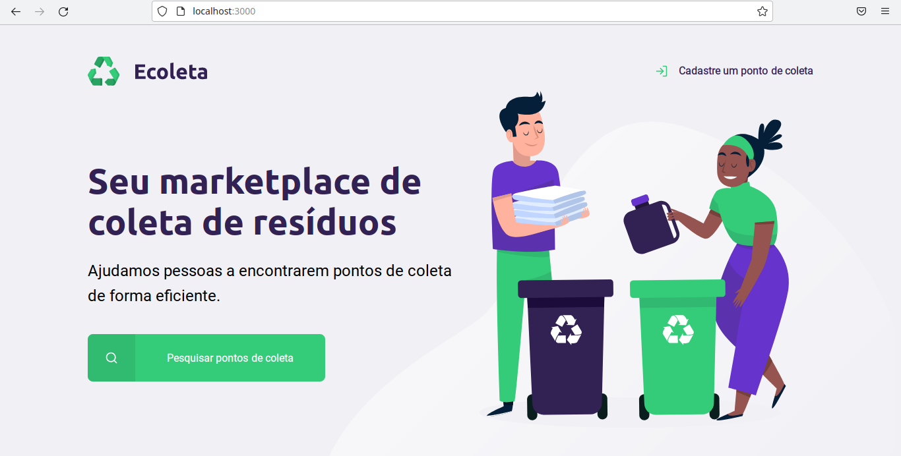
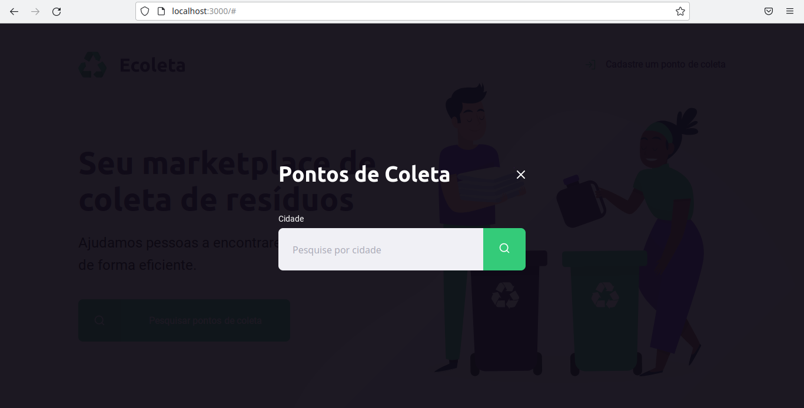
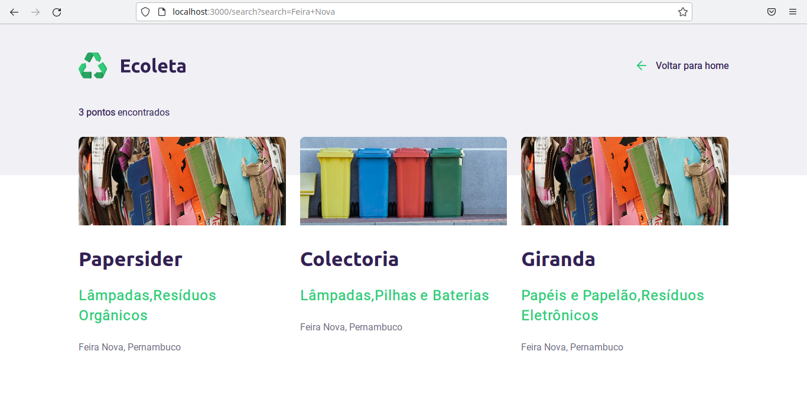

[](https://www.linkedin.com/in/bruno-santanas/)
<h1 align="center"></h1>


<blockquote align="center">  Projeto criado durante a Next-level-week</blockquote>

<p align="center">
Índice
</p> 

<p align="center">
  <a href="#-about-the-project">About the project</a>&nbsp;&nbsp;&nbsp;|&nbsp;&nbsp;&nbsp;
  <a href="#-technologies">Technologies</a>&nbsp;&nbsp;&nbsp;|&nbsp;&nbsp;&nbsp;
  <a href="#-getting-started">Getting started</a>&nbsp;&nbsp;&nbsp;|&nbsp;&nbsp;&nbsp;
  <a href="#-license">License</a>&nbsp;&nbsp;&nbsp;|&nbsp;&nbsp;&nbsp;
  <a href="#-references">References</a>
</p>

## 👨🏻‍💻 About the project

O **ecoleta** é uma aplicação pensanda para facilitar o encontro dos pontos de coleta de materiais recicláveis, onde alí estaria uma página de cadastro onde uma pessoa ou organização estaria cadastrando e identificando qual tpo de material seria tratado.

Home

Modal que busca ponto de coleta

Resultado de busca de ponto de coleta


---
## 🚀 Technologies
O projeto foi desenvolvido utilizando as seguinte tecnologias:
 - [HTML5](https://developer.mozilla.org/pt-BR/docs/Web/HTML/HTML5)
 - [CSS3](https://www.w3schools.com/css/)
 - [Javascript](https://developer.mozilla.org/pt-BR/docs/Aprender/JavaScript)
 - [Node.js](https://nodejs.org/)
 - [Express](https://expressjs.com/)
 - [Nunjucks](https://mozilla.github.io/nunjucks/)
---
## 💻 Getting started
 ```bash
    #clonando o repositório
    $ gitclone https://github.com/BrunoSSantana/Next-level-week/
    
    #entrando o repositório
    cd Launchbase-Rocketseat-Desafio-4-Controle-de-Academia
    
    #instalando os módulos
    npm install
    
    #iniciando a aplicação
    npm start
    
 ```
---
 ## 📝 License
 
 Distribuído sob a licença MIT. Consulte [LICENSE](https://opensource.org/licenses/MIT) para obter mais informações.
 
 ---
 ## ☝ Referencias
 
- [Como criar um RADME | by Daniele Leao Evangelista](https://www.youtube.com/watch?v=Gcb60rPbnKA&t=554s)
- [O que todo projeto deveria ter? #01 | by Mario Solto (Dev Soltinho)](https://www.youtube.com/watch?v=yMRSDdifGW8&t=1107s)
- [Gitmoji](https://gitmoji.carloscuesta.me/)
- [Font Awesome](https://fontawesome.com)
- [Img Shields](https://shields.io)
- [BEST README TEMPLATE](https://github.com/othneildrew/Best-README-Template)

---

:triangular_flag_on_post: By [Bruno Santana](https://github.com/BrunoSSantana)
